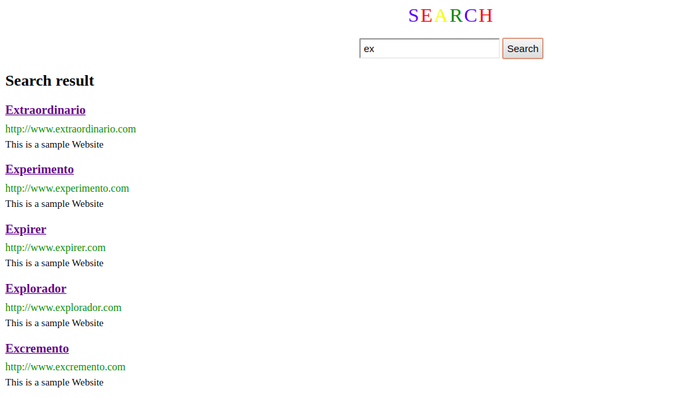

# PageRank
Search engine using pagerank algorithm and prefix tree in Javascript. 
Previous implementation of prefix tree: https://github.com/MagallanesFito/TrieAutocomplete

# Generate dummy data

Run `generate.py` to generate dummy data, this file defines parameters for pagerank algorithm, takes a random sample of words from english_words dataset (https://github.com/dwyl/english-words/) and passes this data to `js/init.js` which finally builds the prefix tree. `init.js` is generated automatically by `generate.py` so make sure to run this python script first. 
Execute ``` python generate.py param1 param2 param3 param4```

 - *param1* is the number of websites in pagerank algorithm (https://en.wikipedia.org/wiki/PageRank)
 - *param2* is damping factor explained here: (https://en.wikipedia.org/wiki/PageRank#Damping_factor)
 - *param3* is epsilon value, makes sure the algorithm converges to certain set of values.
 - *param4* is search limit, limits the number of results in search. 

if no parameters provided, generate.py will run with default parameter values. (Specified in code comments).

Once ``` init.js ``` is generated, it defines all constants used by the program and builds the prefix tree  

> `var trie = new Trie();`

 by inserting all words selected in the previous step into the trie.

# Run Search Engine
Execute ``` index.html ``` to start the program. ``` js/script.js ``` makes all job by calling onload method ``` main()```. 
Write a prefix/word in input field and click search button.

# Screenshots

